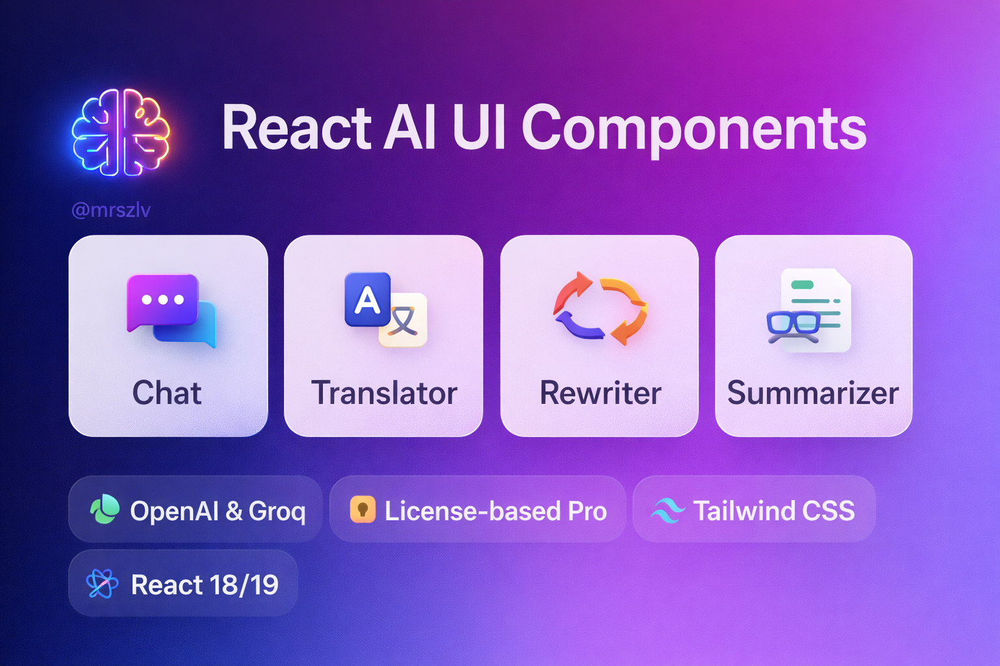

# 🧠 React AI UI Components

<p align="center">
  
</p>

---

[](https://www.npmjs.com/package/@mrszlv/ai-ui-components)
[](./LICENSE)
[](https://github.com/mrszlv/react-ai-kit-MVP-v1)
[](https://www.typescriptlang.org/)

---

## ✨ Features

- ⚛️ React 18+
- 🎨 TailwindCSS styling
- 🤖 OpenAI & Groq support
- 🔐 License-based Pro components
- 📦 Works with Vite, CRA, Next.js

## 📘 How to use @mrszlv/ai-ui-components

This document explains **how the library works**, how to configure it correctly,
and how to avoid common mistakes.

---

## 1️⃣ Core concepts

The library is built around **two required providers**:

1. **LicenseProvider** — controls access to Pro components
2. **AIProvider** — configures AI clients (OpenAI / Groq)

All AI UI components must be rendered **inside both providers**.

LicenseProvider
└─ AIProvider
└─ AI UI Components (ChatBox, Translator, etc.)

## 2️⃣ Installation

```bash
npm install @mrszlv/ai-ui-components
# or
pnpm add @mrszlv/ai-ui-components
# or
yarn add @mrszlv/ai-ui-components
```

## 🎨 Styles (required)

```ts
import "@mrszlv/ai-ui-components/style.css";
```

## 3️⃣ LicenseProvider

### What it does

- Validates a license key
- Enables or disables Pro components
- Shows Paywall UI if the license is invalid or missing

## Usage

```tsx
import { LicenseProvider } from "@mrszlv/ai-ui-components";

<LicenseProvider licenseKey="YOUR_LICENSE_KEY">{/* app */}</LicenseProvider>;
```

If a Pro component is used without a valid license,
the library automatically displays a PaywallCard.

## 4️⃣ AIProvider

### What it does

- Creates an AI client (OpenAI or Groq)
- Provides it to all child components
- Does NOT read environment variables automatically

👉 You must explicitly pass keys via props

### AIProvider props

```ts
AIProviderProps {
  provider?: "openai" | "groq";
  openaiKey?: string;
  groqKey?: string;
}
```

### Minimal example (hardcoded key – NOT recommended)

```tsx
<AIProvider provider="openai" openaiKey="sk-...">
  <ChatBox />
</AIProvider>
```

## 5️⃣ Recommended setup (Vite / React)

### Step 1: Create .env.local

```env
VITE_OPENAI_KEY=sk-...
# or
VITE_GROQ_KEY=gsk_...
# optional
VITE_AI_PROVIDER=openai
```

### Step 2: Pass env values to AIProvider

```tsx
import {
  AIProvider,
  LicenseProvider,
  ChatBox,
  Translator,
  Summarizer,
  Rewriter,
} from "@mrszlv/ai-ui-components";

export default function App() {
  const openaiKey = import.meta.env.VITE_OPENAI_KEY;
  const groqKey = import.meta.env.VITE_GROQ_KEY;

  const provider =
    import.meta.env.VITE_AI_PROVIDER ??
    (openaiKey ? "openai" : groqKey ? "groq" : undefined);

  return (
    <LicenseProvider licenseKey="YOUR_LICENSE_KEY">
      <AIProvider
        initialProvider={provider}
        openaiKey={openaiKey}
        groqKey={groqKey}
      >
        <ChatBox />
      </AIProvider>
    </LicenseProvider>
  );
}
```

## 6️⃣ Available components

All components below require:

- LicenseProvider
- AIProvider

## 🔐 Pro components & License

Some components require a valid license.
Without a license, a built-in Paywall UI will be displayed.

### Pro components

- ChatBox
- Translator
- Rewriter
- Summarizer

## 🛒 Get a license

[👉 Get license](https://t.me/miroszlavpopovics)

## 7️⃣ Free vs Pro

| Feature / Component | Free | Pro |
| ------------------- | ---- | --- |
| Core infrastructure | ✅   | ✅  |
| AI Provider setup   | ✅   | ✅  |
| ChatBox             | ❌   | ✅  |
| Translator          | ❌   | ✅  |
| Rewriter            | ❌   | ✅  |
| Summarizer          | ❌   | ✅  |

### If a Pro component is used without a valid license:

- it will NOT crash the app
- a Paywall UI will be rendered instead

## 8️⃣ Common errors & fixes

### ❌ "No AI client configured"

Reason:
No API key was passed to AIProvider.

Fix:
Pass openaiKey or groqKey explicitly.

### ❌ App crashes on startup

Reason:
Component rendered outside AIProvider or LicenseProvider.

Fix:
Ensure correct provider nesting.

## 9️⃣ Security notes

- API keys in browser apps are visible to users
- Do NOT commit .env.local
- For production, use a backend proxy if needed

## 🔗 Resources

[Repository Git](https://github.com/mrszlv/react-ai-kit-MVP-v1)
[License & Pro access](https://t.me/miroszlavpopovics)

## 🧾 License

- MIT — core infrastructure
- Commercial license required for Pro components

MIT © 2025 Miroslav Popovich
[](./LICENSE.md)
